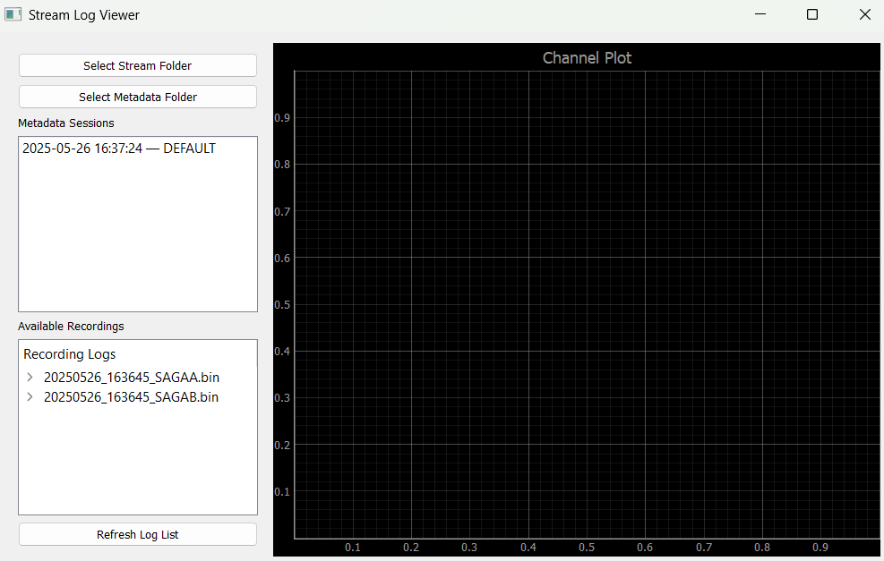

# TMSi MATLAB LSL Interface #
Python apps/tools for interacting with MATLAB TMSi streams via LSL. 

## Quick Start ##
1. [Install](#installation)
2. [Set up Metadata Logging](#logging-parameters)
3. [Set up Stream Logging](#logging-streams)
4. [View Recorded Streams and Metadata](#viewing-streams-offline)
5. [Interacting with Logs](#interacting-with-logs)

## Installation ##
1. Clone this repository.
```bat
git clone git@github.com:Neuro-Mechatronics-Interfaces/TMSi_MATLAB_LSL.git && cd TMSi_MATLAB_LSL
```
2. Create your local Python environment. Call `python` (system Python interpreter) with the `module` option (`-m`) specifying `venv`, which should be a default package with standard Python installations. If `venv` is missing, you may need a more recent Python interpreter version:
```bat
python -m venv .venv && call .venv\Scripts\activate
```
Your terminal should now say `(.venv)` in front of the file path (thanks to `call .venv\Scripts\activate` - now, in this terminal, when you lead with `python` it will refer to the executable installed in `.venv\Scripts\python.exe` instead of your usual Python interpreter).  
3. Add Python requirements to your local Python environment. 
```bat
python -m pip install -r requirements.txt
```
If you type `pip list` you should see that the installed packages are similar or identical to the contents of `requirements.txt`. 

## Logging Parameters ##
After following the steps in [Installation](#installation), you can start logging parameters and trial metadata using:  
```bat
python metadata_logger.py
```
Which should populate a window like this one.  
  
Select the streams you'd like to log. The log binaries will automatically record all channels associated with the stream. Once you click `Start Logging`, the GUI will indicate you are logging:  
  

### 📁 Log File Structure ###
When run_lsl_logger.py is launched and logging is started, the app automatically creates a set of CSV log files inside the specified log directory (default: logs/). These files are prefixed with a timestamp and custom suffix you provide in the GUI.

#### State Logs ####
🔹 `logger_<timestamp>_<suffix>_state.csv`
Captures all state transitions sent by the MATLAB loop.  

**Columns**
- `LSL_Timestamp`: time the message was received by the logger.
- `Loop_Timestamp`: original timestamp assigned in MATLAB.
- `Name`: always "state".
- `Value`: current loop state, e.g. "init", "run", "rec", "idle", etc.

#### Filename Logs ####
🔹 `logger_<timestamp>_<suffix>_filename.csv`
Records filename identifiers sent by the acquisition loop.  

**Columns**
- `LSL_Timestamp`
- `Loop_Timestamp`
- `Name`: "filename"
- `Value`: filename string (e.g. "subject01_block03")

#### Parameter Logs ####
🔹 `logger_<timestamp>_<suffix>_parameter.csv`
Logs all parameter messages received while in the "rec" state.  

**Columns**
- `LSL_Timestamp`
- `Loop_Timestamp`
- `Name`: "parameter"
- `Value`: configuration string passed to the acquisition loop.

#### Trial Logs ####
🔹 `logger_<timestamp>_<suffix>_trials.csv`
High-level log of each recording trial (start, stop, and parameter changes).  

**Columns**
- `Timestamp`: LSL timestamp of the event.
- `File`: filename string active during the trial.
- `Event`:
  + "Recording Start"
  + "Recording End"
  + Or a raw JSON string representing any parameter change during the recording window.

🗒️ These files are appended live during logging and flushed to disk automatically.

---

## Logging Streams ##
After following the steps in [Installation](#installation), you can start logging streams using:  
```bat
python stream_logger.py
```
Which should populate a window like this one.  
  
Select the streams you'd like to log. The log binaries will automatically record all channels associated with the stream. Once you click `Start Logging`, the GUI will indicate you are logging:  
  

As long as the streams are running and you have not clicked `Stop Logging`, samples will continue to be dumped into the generated `.bin` files, meaning they could possibly get very large if you forget and leave it running for a long time (just as a caution). If you are testing this out and have followed along with this and the [Logging Parameters](#logging-parameters) instructions, you should have binary files and csv files in a structure something like this by the time you are done:  
  
You can use the `StreamLogReader` class (and `LogViewer` app, for convenience) to interface with these data.  

## Viewing Streams Offline ##  
To view data from the `.bin` stream recordings as well as associated metadata, you can quickly scan individual channels from selected recordings:   
```bat
python log_viewer.py
```
This should populate an interface which looks similar to the following:  
  
If you selected a different folder for your Streams or Metadata than the default locations (`logs/metadata` and `logs/streams` relative to your repository root folder), then you should update those folders to match using the buttons on the top left.  

Once you select a recording, it will expand to show all the available channels to plot. With this dataset, only the `COUNTER` channel has meaningful data (the sample count that increments with time), so it's selected to illustrate the working parsing of the recorded `.bin` format:  
  
By clicking on the corresponding session metadata in the middle-left panel, it's possible to overlay the event timestamps of any metadata that was logged concurrently with the time-series streams, as shown:  
 
The text next to each line indicates the raw values saved in the `Event` column associated with each timestamped line.  

---

## Interacting with Logs ##

After you've logged your stream `.bin` files and associated parameter/metadata `.csv` files, you can load them into a consistent structure for analysis using the `Data` class:

### 📦 `nml.lsl.Data` class

```python
from nml.lsl.Data import Data
```

This class lets you combine **streamed time-series recordings** with **trial-level event metadata** from a shared logging session.

### 🔧 Instantiating `Data`

You’ll typically instantiate a `Data` object using the datetime-stamped key from your `.bin` files and either:

- The same key (if metadata matches timestamp), or
- A suffix like `"DEFAULT"` (if that's how metadata was labeled).

#### Example:

```python
# Example for a session started on May 26, 2025 at 16:36:45
d = Data('20250526_163645', 'DEFAULT')  # assumes metadata labeled with DEFAULT suffix
```

This loads:
- A 2D NumPy array `d.signal` of shape `[channels, samples]`
- A 1D NumPy array `d.timestamps` of corresponding LSL timestamps
- A dictionary of event DataFrames: `d.metadata['trials']`, `['state']`, etc.

---

## ⏱ Example Analysis Tasks

### 1. 🧠 Plot Time-Series with Trial Annotations

```python
import matplotlib.pyplot as plt
import numpy as np
from nml.lsl.Data import Data

# d = Data('20250526_163645', 'DEFAULT') # Will grab first file in logs/metadata with "DEFAULT" suffix
d = Data('20250526_163645', '20250526_163724') # Equivalent, if you only have one session with "DEFAULT"

sig, ts = d.get_stream_data()
trials = d.get_events('trials')

ch_names = d.metadata['stream']['channel_names']
print(ch_names) # Saved in header metadata of binaries

plt.figure(figsize=(12, 4))
plt.plot(ts, sig[-1], label="COUNTER Channel")

# Add trial event markers
for _, row in trials.iterrows():
    plt.axvline(row['Timestamp'], color='red', linestyle='--')
    plt.text(row['Timestamp'], plt.ylim()[1]*0.9, row['Event'], rotation=90)

plt.xlabel("Time (s)")
plt.ylabel("Amplitude")
plt.title("COUNTER with Trial Markers")
plt.legend()
plt.tight_layout()
plt.show()
```

---

### 2. 🪄 Extract Trial-Aligned Segments

```python
uni_indices = [i for i, name in enumerate(ch_names) if "UNI" in name]
signal_uni = d.signal[uni_indices, :]  # shape: [UNI_channels, samples]

starts = d.get_events('trials')[lambda df: df['Event'] == 'Recording Start']['Timestamp'].values
ends = d.get_events('trials')[lambda df: df['Event'] == 'Recording End']['Timestamp'].values

segments = []

for start, end in zip(starts, ends):
    mask = (d.timestamps >= start) & (d.timestamps <= end)
    trial = signal_uni[:, mask]
    segments.append(trial)
print("Segments for each trial:")
print(segments) # segments now contains the signal segments for monopolar textile arrays, for each trial

```

You now have a list of trial segments, each as a 2D array `[channels × trial_duration]`.

---

### 3. 📊 Compute Feature Summary per Trial

```python
# RMS per trial across UNI channels
print("RMS per trial across UNI channels:")
rms_uni_by_trial = [np.sqrt(np.mean(trial**2, axis=1)) for trial in segments]  # list of [n_UNI_channels] arrays
print(rms_uni_by_trial)
```

This gives you one RMS vector per trial, across channels — perfect for later statistical analysis.

---

You can also replicate these examples in one step using `python example_plot_data.py` - although you'll need to update the filenames with data from your local device. 